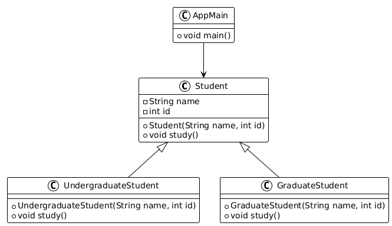

# Task Class Diagram to Code

# Penjelasan Class Modifier di Dart
| Jenis class         | Boleh `extends` di file lain?                                                         | Boleh `implements` di file lain? | Catatan Penting                                                                                                     | Contoh Kasus Praktis                         |
| ------------------- | ------------------------------------------------------------------------------------- | -------------------------------- | ------------------------------------****------------------------------------------------------------------------------- | -------------------------------------------- |
| **sealed**          | ❌ Tidak boleh di file lain (hanya di file yang sama)                                  | ❌ Tidak boleh di file lain       | Semua subclass harus didefinisikan di **file yang sama**. Sangat cocok untuk `switch` exhaustif (pattern matching). | State management, hierarki tertutup.         |
| **base**            | ✅ Boleh di file lain, tapi subclass **wajib** ditandai `base`, `final`, atau `sealed` | ❌ Tidak boleh                    | Pewarisan boleh lintas file, tapi harus jelas “turunannya” apa. Tidak bisa di-`implements`.                         | OOP hierarki yang butuh reuse implementasi.  |
| **final**           | ❌ Tidak boleh di file lain                                                            | ❌ Tidak boleh di file lain       | Tidak bisa diwarisi di luar file. Subclass di file yang sama pun **wajib** ditandai `base`/`final`/`sealed`.        | Utility class, service class, keamanan API.  |
| **interface class** | ❌ Tidak boleh di file lain                                                            | ✅ Boleh di file lain             | Tidak bisa `extends` di file lain, hanya bisa `implements`.                                                         | Kontrak interface untuk dipakai banyak file. |
